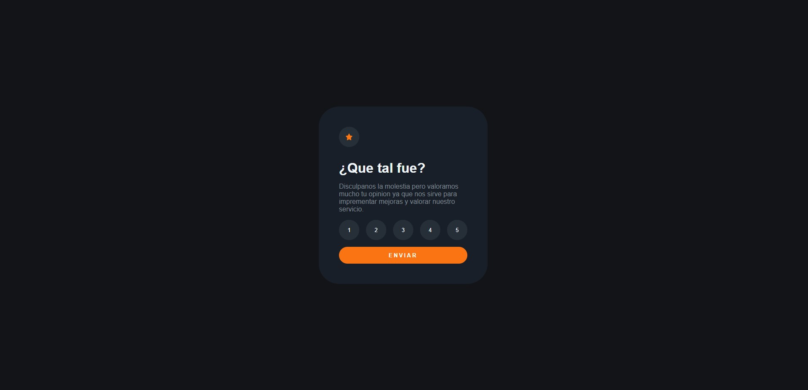
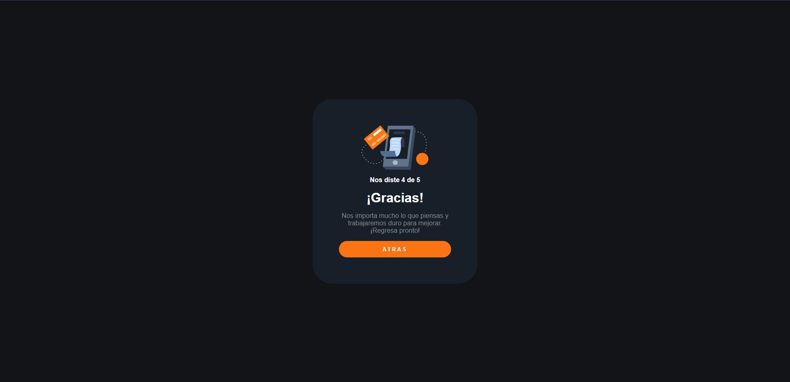

## Welcome 👋👋

# Rank Interactive

*From here I decided to carry out different projects proposed in "Frontend Mentor". This is a rating scores app, which can be easily implemented in any site that offers services. Here the difficulty increased notoriously because I was forced to learn many new functions. I also started to take into account the responsive development of the projects I was doing.*  

### I used

*   DOM Management
*   Dynamic style change
*   InnerHtml
*   Location.Reload
*   ForEach

